# Math Behind the Simulation — Explained for Beginners

This document breaks down every piece of math used in the antibiotic resistance simulation and explains how it affects what you see on screen.

---

## Table of Contents

1. [The Starting Population](#1-the-starting-population)
2. [The Resistance Trait](#2-the-resistance-trait)
3. [Fitness: Who Survives?](#3-fitness-who-survives)
4. [Antibiotic Strength Ramp](#4-antibiotic-strength-ramp)
5. [The Survival Coin Flip](#5-the-survival-coin-flip)
6. [Reproduction: Binary Fission](#6-reproduction-binary-fission)
7. [Population Cap](#7-population-cap)
8. [Mutation](#8-mutation)
9. [Family Assignments](#9-family-assignments)
10. [The Family Tree Visualization](#10-the-family-tree-visualization)
11. [The Survival Race Bars](#11-the-survival-race-bars)
12. [The Histogram](#12-the-histogram)
13. [The Mini-Charts](#13-the-mini-charts)
14. [Worked Example: One Full Generation](#14-worked-example-one-full-generation)

---

## 1. The Starting Population

The simulation starts with **100 bacteria**. Each bacterium gets a random resistance value between 0 and 1.

```
resistance = random number between 0.0 and 1.0
```

Think of this as rolling a 100-sided die for each bacterium. One might get 0.07 (very low resistance), another might get 0.83 (high resistance). This randomness mirrors real biology — individuals naturally vary.

**What you see:** The population counter shows "100" at generation 0. If you switch to the "Individuals" view, you'll see 100 colored dots.

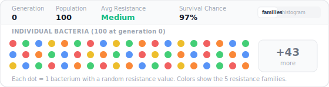

---

## 2. The Resistance Trait

Each bacterium has one trait: **resistance**, a number from 0.0 to 1.0.

- `0.0` = no resistance at all (completely vulnerable to antibiotics)
- `0.5` = moderate resistance
- `1.0` = maximum resistance (almost immune to antibiotics)

This single number determines whether a bacterium lives or dies when antibiotics arrive.

**What you see:** The "Avg Resistance" stat in the header shows the average resistance across all bacteria, translated into a word:
- 0.00–0.19 → "Very low"
- 0.20–0.39 → "Low"
- 0.40–0.59 → "Medium"
- 0.60–0.79 → "High"
- 0.80–1.00 → "Very high"

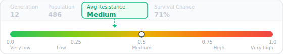

---

## 3. Fitness: Who Survives?

Fitness is a number from 0.0 to 1.0 that represents a bacterium's chance of surviving the current environment. The formula changes depending on whether antibiotics are present.

### Before antibiotics (generations 0–9)

```
fitness = 1.0 - resistance × 0.05
```

This means resistance has a **tiny cost**. A bacterium with resistance 0.0 has fitness 1.0 (perfect). A bacterium with resistance 1.0 has fitness 0.95 (barely worse). The idea: maintaining resistance machinery uses a little extra energy, but it barely matters.

| Resistance | Fitness | Meaning |
|---|---|---|
| 0.00 | 1.000 | Perfect — no wasted energy |
| 0.50 | 0.975 | Barely noticeable cost |
| 1.00 | 0.950 | Tiny disadvantage |

**What you see:** Before antibiotics, all families are roughly equal. The survival bars are about the same length. The "Survival Chance" stat is near 97%.

### After antibiotics (generation 10+)

Now fitness depends on whether the bacterium's resistance is **above or below** the antibiotic strength.

**If resistance ≥ antibiotic strength** (bacterium is protected enough):

```
gap = resistance - antibioticStrength
fitness = 0.7 + 0.3 × min(gap / 0.3, 1)
```

This gives a fitness between 0.7 and 1.0. The bigger the gap (more resistance than needed), the better. If the gap is 0.3 or more, fitness maxes out at 1.0.

| Resistance | Antibiotic Strength | Gap | Fitness |
|---|---|---|---|
| 0.90 | 0.55 | +0.35 | 1.00 (maxed out) |
| 0.70 | 0.55 | +0.15 | 0.85 |
| 0.55 | 0.55 | 0.00 | 0.70 (just barely enough) |

**If resistance < antibiotic strength** (not protected enough):

```
deficit = antibioticStrength - resistance
fitness = max(0.002, 0.1 × (1 - deficit)⁴)
```

This is the **death curve**. The `(1 - deficit)⁴` part drops extremely fast. The exponent of 4 makes it steep — being a little below the threshold is much worse than being a lot below.

| Resistance | Antibiotic Strength | Deficit | Fitness | Survival Chance |
|---|---|---|---|---|
| 0.50 | 0.55 | 0.05 | 0.081 | ~8% |
| 0.30 | 0.55 | 0.25 | 0.032 | ~3% |
| 0.10 | 0.55 | 0.45 | 0.009 | ~1% |
| 0.00 | 0.55 | 0.55 | 0.004 | ~0.4% |

**What you see:** After antibiotics arrive, the "Survival Chance" stat drops sharply. Families with low resistance (Tiny, Scout) see their bars shrink rapidly because most of their members have fitness near 0.

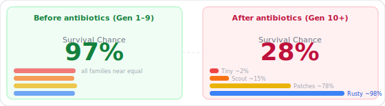

---

## 4. Antibiotic Strength Ramp

Antibiotics don't hit at full strength immediately. They ramp up gradually:

```
if generation < 10:
    strength = 0 (no antibiotics yet)
else:
    strength = min(0.55, (generation - 10) × 0.1)
```

This means:
- Generation 10: strength = 0.0 × 0.1 = 0.00 (just introduced)
- Generation 11: strength = 1 × 0.1 = 0.10
- Generation 12: strength = 2 × 0.1 = 0.20
- Generation 13: strength = 3 × 0.1 = 0.30
- Generation 14: strength = 4 × 0.1 = 0.40
- Generation 15: strength = 5 × 0.1 = 0.50
- Generation 16+: strength = 0.55 (maximum)

The ramp takes about 6 generations to reach full strength. The maximum of 0.55 means bacteria with resistance above ~55% can survive long-term.

**What you see:** The red "Antibiotics" badge in the header shows the current strength as a percentage (e.g., "Antibiotics 40%"). The red dashed line on the family tree marks generation 10. Families die one by one as strength increases — Tiny dies first, then Scout, then Patches, because their resistance is below each new threshold.

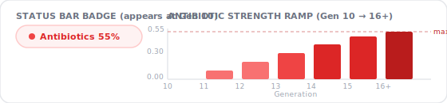

---

## 5. The Survival Coin Flip

Every generation after antibiotics arrive, each bacterium faces a coin flip:

```
if random() >= fitness:
    bacterium dies
```

So fitness IS the probability of surviving. If a bacterium has fitness 0.85, there's an 85% chance it survives and a 15% chance it dies. If fitness is 0.01, there's only a 1% chance of survival.

This is like rolling a 100-sided die for each bacterium. If the roll is higher than their fitness × 100, they're dead.

**What you see:** The population might dip after antibiotics arrive. In the family tree, some branches stop (that bacterium died). The survival bars for low-resistance families collapse because almost all their members fail the coin flip.

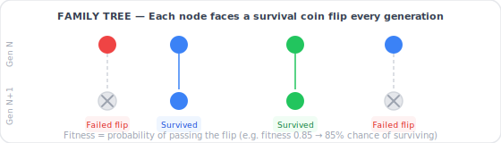

---

## 6. Reproduction: Binary Fission

Bacteria reproduce by **splitting in two**. In the simulation, each surviving bacterium produces **3 clones** (not 2, to speed things up).

```
for each surviving bacterium:
    create 3 offspring, each a near-copy of the parent
```

Each offspring inherits its parent's resistance value (with a possible small mutation — see Section 8).

**What you see:** The population grows quickly. Starting from 100, it reaches the cap of 500 within a few generations. In the family tree, each colored node can have up to 3 lines going down to the next row.

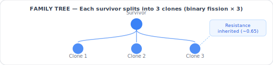

---

## 7. Population Cap

The environment can only support so many bacteria. The maximum population is **500**.

If all survivors would produce more than 500 offspring, not everyone gets to reproduce. The simulation picks which survivors reproduce using **fitness-proportionate selection**:

```
totalFitness = sum of all survivors' fitness values
probability of being chosen = individual fitness / totalFitness
```

A bacterium with fitness 0.9 is about 9× more likely to be chosen than one with fitness 0.1. This is like a raffle where fitter bacteria have more tickets.

**How many parents are needed?**

```
needed = floor(500 / 3) = 166 parents
```

So 166 bacteria are randomly selected (weighted by fitness), and each produces 3 offspring = 498 bacteria in the next generation.

**What you see:** The population counter hovers around 498–500 in most generations. After antibiotics cause mass death, the population dips (fewer survivors = fewer offspring), then recovers as the resistant survivors multiply.

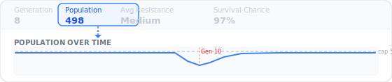

---

## 8. Mutation

When a bacterium copies its DNA to make offspring, there's a small chance of an error:

```
if random() < 0.008:   (0.8% chance per offspring)
    resistance += random number between -0.03 and +0.03
```

Breaking this down:
- **0.008** = 0.8% chance of any mutation at all (99.2% of the time, the offspring is an exact clone)
- **0.03** = maximum size of the change (resistance can shift by at most ±0.03)
- The change is random — equally likely to increase or decrease resistance

The resistance is then clamped to stay between 0.0 and 1.0:

```
resistance = max(0.0, min(1.0, resistance))
```

**Why this matters:** Mutation is very rare and very small. A bacterium with resistance 0.10 can't suddenly jump to 0.90 through mutation. Over 40 generations, it might accumulate a few mutations totaling ±0.05. This means a family's trait value stays coherent — Tiny's descendants will always have low resistance, and Tank's will always have high resistance.

**What you see:** The "avg resistance" value on the survival bars stays very close to the family's starting value throughout the simulation.


---

## 9. Family Assignments

At generation 0, every bacterium is assigned to one of 5 families based on its resistance:

```
bandWidth = 1.0 / 5 = 0.2

Tiny:    resistance 0.00–0.19
Scout:   resistance 0.20–0.39
Patches: resistance 0.40–0.59
Rusty:   resistance 0.60–0.79
Tank:    resistance 0.80–1.00
```

With 100 starting bacteria and a uniform random distribution, each family gets roughly **20 members**.

Since reproduction is asexual (one parent per offspring), every future offspring belongs to the same family as its parent. A child of a Tank member is always a Tank member, forever. This is tracked by a permanent lookup table that never gets pruned.

**What you see:** The family legend shows 5 colored labels. The survival bars show each family's descendant count. The tree shows each family in its own vertical lane.

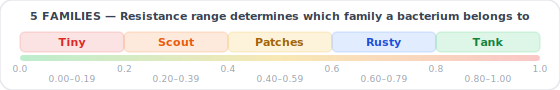

---

## 10. The Family Tree Visualization

The tree shows each family as a vertical column of circles. Here's the math:

### Layout

```
laneWidth = max(140, 800 / numberOfFamilies)  = 160px per family
ROW_HEIGHT = 48px per generation
```

Each node's position:
```
x = laneCenter - (count - 1) × spacing / 2 + index × spacing
y = generation × 48 + 24
spacing = min(laneWidth × 0.85 / count, 34)
```

### Circle size

Each circle's radius depends on the bacterium's fitness:

```
radius = 4 + (9 - 4) × fitness
       = 4 + 5 × fitness
```

So:
- Fitness 0.0 → radius 4px (tiny circle)
- Fitness 0.5 → radius 6.5px
- Fitness 1.0 → radius 9px (largest circle)

**What you see:** After antibiotics arrive, the surviving circles are slightly larger (higher fitness) than the ones that were dying before.

### Display limit

Each family can show at most **4 nodes per generation** (even if the family has 40 actual members). The selection prioritizes:

1. **Alive nodes** — nodes that have at least one child in the next generation
2. **Connected nodes** — nodes whose parent is visible in the row above (score bonus: +10,000)
3. **Higher fitness** — among ties, fitter bacteria are shown (score: 0.0–1.0)

This ensures the tree shows clean connected chains rather than disconnected floating dots.

### Edge curves

Parent-child connections are drawn as curved lines (cubic Bezier curves):

```
path = "M parentX,parentY C parentX,midY childX,midY childX,childY"
where midY = (parentY + childY) / 2
```

This creates a smooth S-curve between each parent and child.

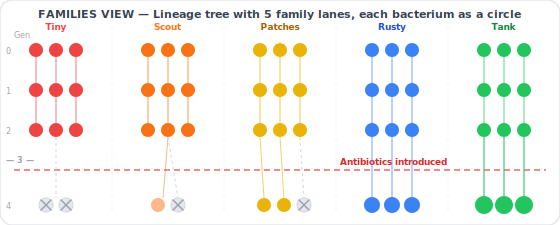

---

## 11. The Survival Race Bars

Each bar's width is proportional to the family's descendant count:

```
barWidth = (familyDescendants / maxDescendantsAmongAllFamilies) × 100%
```

If Tank has 40 descendants and that's the most of any family, Tank's bar is 100% width. If Rusty has 12, Rusty's bar is 12/40 = 30% width.

The bar also shows the average resistance of living descendants:

```
avgTrait = sum of all descendants' resistance / count of descendants
```

**What you see:** "Tank: 156 · 89%" means Tank has 156 living descendants with an average resistance of 89%. Extinct families have their bar go to 0% width, their name gets a strikethrough, and they show an "EXTINCT" badge.

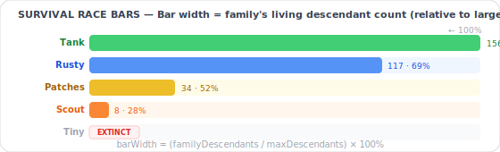

---

## 12. The Histogram

The histogram divides resistance into 24 equal bins and counts how many bacteria fall in each:

```
binWidth = 1.0 / 24 ≈ 0.042
bin index = floor(resistance × 24)
```

Each bar's height:

```
barHeight = (count in this bin / count in the tallest bin) × 100%
```

The color of each bar depends on the trait value at its center:

```
For antibiotic resistance:
  hue = 130 - value × 130     (green at 0, red at 1)
  saturation = 60 + value × 20
  lightness = 55 - value × 15
```

**What you see:** Before antibiotics, the histogram is roughly flat (uniform distribution). After antibiotics, the left side (low resistance) empties out, and the right side (high resistance) grows tall. This visually shows the population shifting toward resistance.

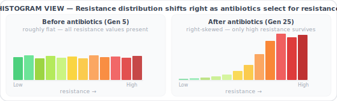

---

## 13. The Mini-Charts

Three line charts track values over time. Each is a small SVG:

```
chartWidth = 200, chartHeight = 60
x = padding + (dataIndex / (dataLength - 1)) × (width - 2 × padding)
y = height - padding - ((value - minValue) / range) × (height - 2 × padding)
```

The three metrics:
- **Avg Resistance Level** = mean of all bacteria's resistance values
- **Avg Survival Chance** = mean of all bacteria's fitness values
- **Population Size** = count of living bacteria

Each chart also shows a **trend arrow**: if the latest value is higher than the previous one, the arrow points up (green). If lower, it points down (red).

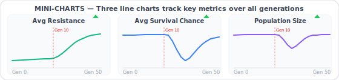

---

## 14. Worked Example: One Full Generation

Let's walk through what happens at **generation 12** step by step.

**Setup:** Antibiotic strength = min(0.55, (12 - 10) × 0.1) = **0.20**

**Step 1: Calculate fitness for every bacterium**

| Bacterium | Resistance | Gap (r - 0.20) | Fitness |
|---|---|---|---|
| Tiny member | 0.08 | -0.12 | max(0.002, 0.1 × (1 - 0.12)⁴) = 0.1 × 0.60 = **0.060** |
| Scout member | 0.28 | +0.08 | 0.7 + 0.3 × min(0.08/0.3, 1) = 0.7 + 0.08 = **0.780** |
| Patches member | 0.48 | +0.28 | 0.7 + 0.3 × min(0.28/0.3, 1) = 0.7 + 0.28 = **0.980** |
| Tank member | 0.90 | +0.70 | 0.7 + 0.3 × min(0.70/0.3, 1) = 0.7 + 0.3 = **1.000** |

**Step 2: Survival coin flip**

- Tiny member (fitness 0.060): 6% chance of surviving → almost certainly dies
- Scout member (fitness 0.780): 78% chance → probably survives
- Patches member (fitness 0.980): 98% chance → almost certainly survives
- Tank member (fitness 1.000): 100% chance → always survives

**Step 3: Survivors reproduce**

Say 200 bacteria survived. Each makes 3 clones → 600 offspring. But the cap is 500, so only floor(500/3) = 166 parents get to reproduce, chosen by fitness.

**Step 4: Mutation**

For each of the 498 offspring, there's a 0.8% chance of a ±0.03 mutation. In a population of 498, about 4 bacteria will have a mutation. The rest are exact clones.

**Net effect at generation 12:** Most of Tiny's family is dead. Scout is struggling but hanging on. Patches and Tank are thriving. The population has dipped from 500 to maybe 400 (due to Tiny's deaths) but will recover next generation as the survivors multiply.

---

## Summary of Key Numbers

| Parameter | Value | What It Controls |
|---|---|---|
| Starting population | 100 | How many bacteria at gen 0 |
| Max population | 500 | Cap on total bacteria |
| Offspring per parent | 3 | How fast the population grows |
| Antibiotic start | Generation 10 | When selection pressure begins |
| Antibiotic max strength | 0.55 | How harsh the environment gets |
| Strength ramp rate | +0.10 per gen | How fast antibiotics get stronger |
| Mutation chance | 0.8% per offspring | How often a copying error occurs |
| Mutation size | ±0.03 max | How much a mutation can change resistance |
| Families | 5 (bands of 0.2) | How the population is divided for tracking |
| Tree display limit | 4 per family per gen | Max circles shown per row per family |
| Circle radius | 4–9 px | Scaled by fitness |
| Generations | 50 total | Length of the simulation |
